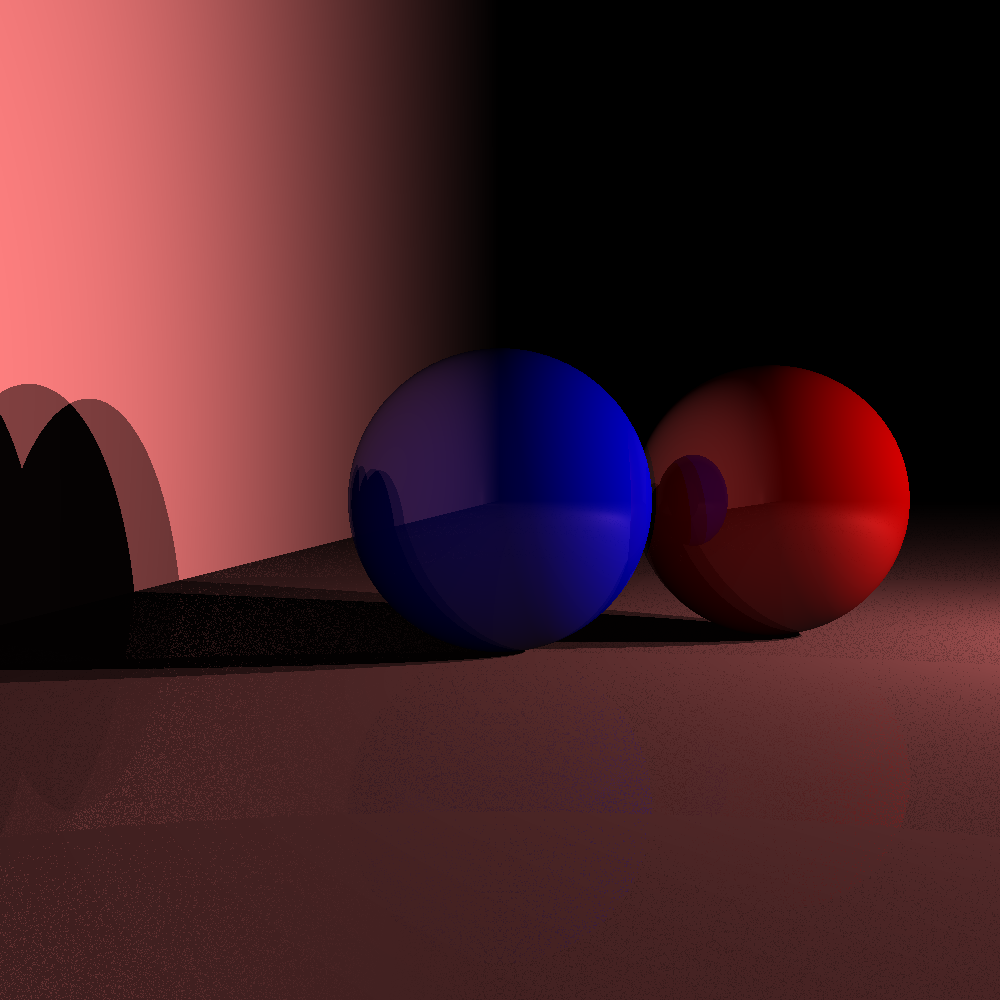

# Haskell Raytracer

A simple raytracer written in Haskell

Below is an example input with two spheres, two planes, and three point lights.



## Building

Use [stack](http://haskellstack.org).

```
stack build
stack exec raycaster
```

